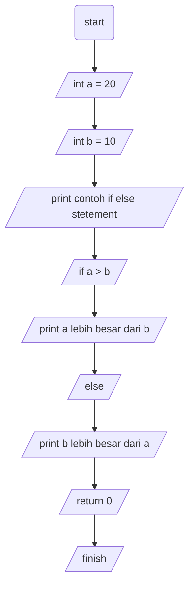

```mermaid
flowchart TD;
    A(start)--> B[/int a = 20/];
    B --> C[/int b = 10/];
    C --> D[/print contoh if else stetement/];
    D --> E[/if a > b/];
    E --> F[/print a lebih besar dari b/];
    F --> G[/else/];
    G --> H[/print b lebih besar dari a/];
    H --> I[/return 0/];
    I --> J[/finish/];
```