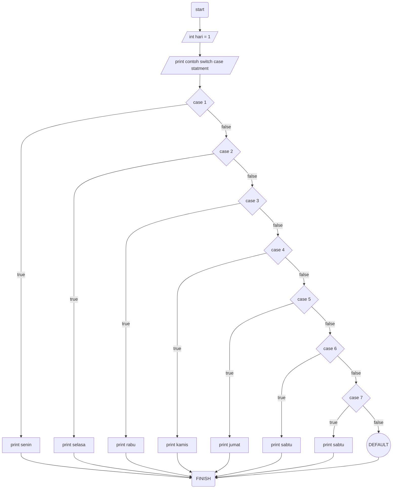

```mermaid
flowchart TD;
    A(start)--> B[/int hari = 1/];
    B --> C[/print contoh switch case statment/];
    C --> D{case 1}; 
    D --true --> E[print senin];
    D --false --> F{case 2};
    F --true --> G[print selasa];
    F --false --> H{case 3};
    H --true --> I[print rabu];
    H --false --> J{case 4};
    J --true --> K[print kamis];
    J --false --> L{case 5};
    L --true --> M[print jumat];
    L --false --> N{case 6};
    N --true --> O[print sabtu];
    N --false --> P{case 7};
    P --true --> Q[print sabtu];
    P --false --> R((DEFAULT));
    E & G & I & K & M & O & Q & R --> S(FINISH);
```